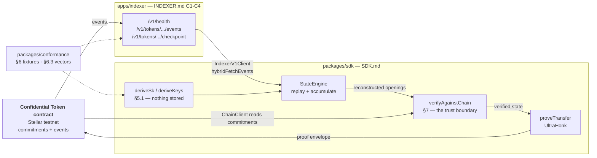

<div align="center">

# stellar-confidential-token-sdk

**A TypeScript client for [OpenZeppelin Confidential Tokens](https://github.com/OpenZeppelin/stellar-contracts) on Stellar — and the verifiable archive it replays history from.**

[](https://github.com/aguilar1x/stellar-confidential-token-sdk/actions/workflows/ci.yml)
[](https://www.npmjs.com/package/stellar-confidential-token-sdk)
[](./LICENSE)


[**Live demo**](https://stellar-confidential-token-sdk-web.vercel.app/demo) ·
[**Don't trust your indexer**](https://stellar-confidential-token-sdk-web.vercel.app/verify) ·
[**Docs**](https://stellar-confidential-token-sdk-web.vercel.app/docs) ·
[**Architecture**](#architecture) ·
[**What it surfaced**](#what-building-this-surfaced)

</div>

Building a conformant client turned up **five defects** — including two of
OpenZeppelin's own audit fixes that never reached the deployed testnet verifier,
and a blinding-factor bug that a building collecting its dues caught in 33 real
transactions.

```bash
npm install stellar-confidential-token-sdk
```

```ts
import { deriveSk, deriveKeys, skSigningMessage } from "stellar-confidential-token-sdk";
import { proveTransfer } from "stellar-confidential-token-sdk/node";

// The account secret is DERIVED, never stored — same signer, same key, forever.
const root = await wallet.signMessage(skSigningMessage(CONTRACT, ACCOUNT));
const { sk, addrF } = deriveSk(root, CONTRACT, ACCOUNT);       // SDK.md §5.1

const { payload, next } = await proveTransfer({
  keys: deriveKeys(sk, addrF),
  v: spendable.v, r: spendable.r,
  amount: 750_0000000n,
  pvkB: recipientViewingKey, kAudR: auditorKey, kAudS: auditorKey,
});
// PERSIST `next` BEFORE SUBMITTING. It is the only thing that can spend the result.
```

**224 tests · testnet only · not audited — do not hold value with this.**

<details>
<summary><b>Why an archive specification matters</b> — the recovery problem in 60 seconds</summary>

The chain stores *commitments*; only the wallet holds the *openings* that can
spend them. So the wallet is load-bearing in a way most wallets are not — an
opening that is lost, or derived slightly differently on a second device, is
money that cannot be moved.

Recovering that state past the RPC's seven-day window means replaying history
from an archive. An audit of those contracts flagged that the specification for
such an archive did not exist ([finding N-08, issue #787][issue]: recovery was
normative while `INDEXER.md` was still "to be added", so implementations could
diverge with nothing to implement against). July 2026 filled both gaps —
[`SDK.md`][sdk] for the client's obligations, [`INDEXER.md`][indexer] for what an
archive must serve and how a client must verify it rather than trust it.

This repository implements both — 15 of 17 published primitives byte-for-byte,
C1–C4 served and verified, and the two exceptions documented below with their
upstream audit findings.

</details>

---

## What building this surfaced

| # | What | Status |
|---|---|---|
| 1 | Deployed testnet verifier predates OpenZeppelin's [L-03][l03] ECDH fix ([#778][pr778], merged 17 Jul) | reproducible via `examples/drift.mjs` |
| 2 | Deployed testnet verifier predates their [N-07][n07] pad fix ([#792][pr792], merged 16 Jul) | same |
| 3 | `δ_ecdh` and `DISCLOSURE` both claim domain tag 13 | pinned in `divergences.js` |
| 4 | Blinding factors accumulated mod `r`, not mod `p` | found by the condominium, fixed in 0.1.1 |
| 5 | Two of §6.3's three required vectors did not exist | generated, in OpenZeppelin's testdata format |

Neither vulnerability in 1 or 2 is our discovery — both are OpenZeppelin's own
audit findings, already fixed upstream. What this project adds is that **the
deployed verifier still behaves the pre-fix way.** The fixtures moved on 16–17
July; the deployment did not follow.

**→ [FINDINGS.md](./FINDINGS.md)** for all five in full, with the reproduction
for each.

---

## Architecture

The client never trusts the archive. It replays history from the archive, then
re-derives its openings and checks them against the chain's own commitments.



Two arrows enter `verifyAgainstChain` — one from the archive, one from the
chain. That is the entire argument: **an archive can lie, and the mismatch is
caught.**

> Everything above `verifyAgainstChain` is untrusted input. The archive, the RPC
> and the event decoder can all be wrong or hostile; the client's position is
> that it does not matter, because reconstructed openings are re-committed and
> compared byte-for-byte against the points the chain holds. `INDEXER.md` §7
> scopes archive trust to "availability and completeness only — never
> confidentiality or integrity", and this is the code that makes that scoping
> real rather than aspirational.

### The four pieces, and why they are four

| | is | why it is separate |
|---|---|---|
| `packages/sdk` | the client library, published to npm | The only artifact an integrator consumes. Three entry points, enforced by a runtime boundary. |
| `packages/conformance` | the `SDK.md` §6 suite | Depends on `stellar-confidential-token-sdk` **by package name**, not by relative path — so it tests the built public surface, not internals. |
| `apps/indexer` | an `INDEXER.md` archive, as a Web-standard `fetch` handler | A service, not a library. The SDK never imports it; the only coupling is the wire format. |
| `apps/web` | the demo | Where client, archive and chain all meet. `/verify` runs the same code path as `examples/sabotage.mjs`, so the page and the CLI cannot disagree. |

### Three entry points, enforced by tests

The split is a runtime contract, not organisation:

| Import | Guarantee | Holds |
|---|---|---|
| `stellar-confidential-token-sdk` | imports no `node:*` module, transitively | crypto, account, witness builders, XDR payload encoders, `CircuitProver`, disclosure, `StateEngine` |
| `…/node` | everything that touches `node:fs` | vendored-circuit and pinned-VK loaders, `proveRegister`/`proveTransfer`/`proveWithdraw`, `JsonFileStore` |
| `…/chain` | fetch-only | `ChainClient`, XDR event decode, `IndexerV1Client`, the hybrid event source, auditor decrypt |

`/chain` exists for a specific reason: the chain-layer `ConfidentialEvent` union
collides by name with the state engine's, and both cannot be `export *`-ed from
one barrel. The state-engine surface won the top level. `src/index.test.ts` and
`src/node.cjs.test.ts` pin the boundary, so a stray `node:` import fails CI
rather than a browser build.

---

## Design decisions

The non-obvious ones, with the alternative each rejected.

**The client verifies the archive; it does not trust it.** Two layers, and the
split is load-bearing. C3 catches an honest gap — `fetchEvents` defaults to
`requireComplete: true` and throws `IncompleteHistoryError` rather than returning
a partial replay. §7 catches a *lying* archive, because a completeness flag is
only as good as the party asserting it. → `chain/indexer-v1.ts`

**A missing `complete` field reads as `false`, not `true`.** C3 is REQUIRED, so
silence means non-conformant, and the safe reading of silence is "I cannot vouch
for this range."

**`verifyAgainstChain` compares 64-byte encodings, not decoded points.**
Decode-then-compare would *throw* on bytes that land off-curve, turning arbitrary
tampering into an exception instead of a mismatch. Byte-wise means every tamper
reports as what it is. → `state/engine.ts`

**`sk` is derived from a signature, never stored.** A client that draws `sk`
randomly can never rebuild the account from a seed, whatever archive it replays.
The SDK deliberately does not touch the wallet — the caller supplies the root —
so `deriveSk` stays pure and testable. → `crypto/sk-derivation.ts`

**Blindings accumulate modulo `p`, not modulo `r`.** The chain adds commitment
*points*; their scalars reduce mod the group order. This is defect 4, and the
fix is two lines with a test that proves the test is not vacuous.

**The compiled circuits ship inside the npm tarball**, and `proveTransfer` takes
a `circuit?` override. The artifact must be byte-identical to what the deployed
verifier expects, so vendoring beats fetching — and the override exists because a
bundler that traces dependencies will prune a path resolved at runtime.
→ `proving/ops.ts`

**The archive is a Web-standard `fetch` handler.** §7 wants at least two
*independent* archives; two implementations that behave differently defeat the
requirement as thoroughly as one endpoint does. One handler, several runtimes,
deployment as a config detail. → `apps/indexer/src/handler.js`

**C3 is asserted over the requested range, not over what was returned.** Clamping
to what the archive holds would make every gap look like an empty range —
precisely the failure the flag exists to prevent. Empty ranges are recorded as
ingested for the same reason: "I looked and there was nothing" is a completeness
fact.

**Each adversary is a `Proxy` over the honest store**, overriding only its one
lie — so a rejection cannot come from the archive being broken in some unrelated
way. → `apps/indexer/src/tamper.js`

---

## See it work

Nothing to install. The two that matter:

- **[A building collecting its dues](https://stellar-confidential-token-sdk-web.vercel.app/demo)** —
  eight units pay different amounts, none of them on-chain, and every resident
  can still audit the total. Pedersen commitments add, so the chain ends up
  holding a commitment to the sum without ever holding one to any single
  payment. A normal ledger makes you pick between an auditable total and private
  line items; this does not.
- **[Don't trust your indexer](https://stellar-confidential-token-sdk-web.vercel.app/verify)** —
  that guarantee only holds if the history the wallet replays is the real one.
  Five archives serve one account's history; three of them lie. The same client
  reads all five.

Or run it yourself:

| | Command |
|---|---|
| A real confidential payment on testnet, from a single signer | `npm install && node examples/live-payment.mjs` |
| Break the archive it depends on, watch the client refuse it | `ALICE_SECRET=… node examples/sabotage.mjs` |
| Reproduce both circuit divergences against OpenZeppelin's live fixtures | `node examples/drift.mjs` |
| The building's 33 transactions, from scratch | `node examples/condominium.mjs` |

```
ACCEPTED  honest      a faithful archive
          §7: openings match the chain

REJECTED  lagging     honest, but cannot vouch for the range
          C3: archive admitted an incomplete history

REJECTED  omitting    drops your merge, still claims complete: true
          §7: commitment mismatch on receiving
          it would have told you: receiving 1000000000     ← 100 XLM that do not exist

REJECTED  corrupting  alters your balance ciphertext, still claims complete: true
          §7: commitment mismatch on spendable
          it would have told you: spendable 600000001      ← wrong by a single stroop
```

Three adversaries, caught by two different defences, and the split is the whole
argument. The lagging archive is caught by C3 — it admits the gap itself. The
other two lie, claiming `complete: true`, so C3 cannot help. They are caught
because the client re-derives its openings and checks them against the chain
(§7). Note the last line: wrong by one stroop, and still caught.

The layering is pinned in CI (`apps/indexer/test/tamper.test.js`), not merely
demonstrated: a change that made C3 appear to catch the lying archives would
fail the build, because it would mean the adversary had stopped lying.

### Two operators, because §7 asks for two

§7 asks deployments to run "at least two" independent archives — two instances
on one provider share an outage, which is the failure the requirement exists to
prevent. There are two, on different providers, and the demo checks both the
same way:

```bash
curl https://confidential-token-archive.aaguilar1x.workers.dev/v1/health
# {"latest_ledger":…,"ingested_through":…,"ingested_from":3976100,"lag_seconds":0}
```

`curl` shows you the health response; what exercises the contract is
`IndexerV1Client` — which the demo's `/verify` page and
[`examples/sabotage.mjs`](examples/sabotage.mjs) both run against it.

---

## Verify the published package in one command

No clone, no build, nothing to trust. This installs the published package from
the npm registry into a throwaway directory, fetches OpenZeppelin's fixtures from
**their** repository and reproduces them byte-for-byte, derives a key through
§5.1, generates a real UltraHonk proof against the circuits inside the tarball,
and shows a one-stroop tamper being refused:

```bash
curl -fsSL https://raw.githubusercontent.com/aguilar1x/stellar-confidential-token-sdk/master/scripts/verify-published.mjs | node --input-type=module
```

```
installed stellar-confidential-token-sdk@0.1.2

1 · OpenZeppelin's published fixtures, byte-for-byte
    15 reproduced exactly
    ecdh DIVERGES — deployed circuits use x-only; spec absorbs both coordinates
    encrypt_auditor_sender_balance DIVERGES — deployed circuits use the first sponge squeeze; spec the second
2 · §5.1 derivation    same signer, same key, twice
3 · UltraHonk proof    15308 XDR bytes in 1.5s
4 · one-stroop tamper  rejected: commitment differs, so the opening cannot verify
```

It prints the two divergences rather than hiding them, and **fails** if a third
appears. A fixture it cannot fetch is reported and counted out, never silently
counted in. It is the same script CI runs on every push, which is what the badge
above asserts.

Step 3's timing is whatever your own machine manages — 1.5s on an M-series
laptop, around 6s on the serverless CPU behind the demo site. Proving cost is a
property of the hardware, so any single number quoted without one is decoration.

---

## Evidence

Not a test count — a list of claims, and what would fail if each were false.

| Claim | What would fail if it were false | Where |
|---|---|---|
| The primitives match OpenZeppelin's published fixtures | 28 checks against **their** fixture files | `packages/conformance/test/fixtures.test.js` |
| The witness builders produce witnesses the deployed circuits accept | 9 checks that execute the **real compiled circuits**, including tamper cases | `test/circuit-parity.test.js` |
| §5.1 derivation is byte-identical across devices and runs | 14 checks over the §6.3 vectors, pinning the SEP-0053 preimage, the signature, `sk`/`vk`/`Y`/`PVK` and the rejection counter | `test/vectors-63.test.js` |
| The archive answers C1–C4 honestly, including about its own gaps | 20 checks incl. "refuses a range with a hole in the middle" | `apps/indexer/test/roundtrip.test.js` |
| A lying archive is caught even when it claims `complete: true` | 8 checks that each adversary is faithful except in the attacked dimension | `apps/indexer/test/tamper.test.js` |
| The published tarball does what the source does | installs from the registry and runs the whole flow | `scripts/verify-published.mjs`, CI job `published` |

**224 tests** — 145 in the SDK, 51 in conformance, 28 in the archive. `npm test`
at the root runs all three; CI runs them on every push and weekly against
upstream.

### What the conformance suite proves that unit tests cannot

1. **The expected values are not ours.** A unit test asserts a number this
   codebase chose. The fixture suite asserts numbers OpenZeppelin published,
   vendored for hermeticity, with a weekly CI job that re-fetches and
   byte-compares so the copy cannot become a fork.
2. **The suite tests itself for vacuity.** *"covers every fixture — an unmapped
   primitive is a conformance GAP"*, *"every fixture carries at least one
   vector"*, *"a value that differs in one bit fails"*. That is the difference
   between a suite and a claim.
3. **It runs the real prover against the real circuits, and shows them saying
   no.** Unit tests can only prove self-consistency — they cannot distinguish
   "correct" from "consistently wrong", which is exactly the failure mode a ZK
   client has.
4. **It consumes the SDK as an external package**, by name, so it tests the
   built public surface. That is what lets the `published` CI job catch what
   every source test misses: a bad `files` list, a wrong `exports` map, a missing
   circuit asset.

---

## Use it

Requires **Node ≥ 20**. Full API reference:
**[the docs page](https://stellar-confidential-token-sdk-web.vercel.app/docs)**.

```ts
import { deriveSk, deriveKeys, StateEngine, pointToBytes } from "stellar-confidential-token-sdk";
import { proveTransfer } from "stellar-confidential-token-sdk/node";
import { ChainClient, IndexerV1Client } from "stellar-confidential-token-sdk/chain";

const { sk, addrF } = deriveSk(root, CONTRACT, ACCOUNT);   // §5.1, nothing stored
const keys = deriveKeys(sk, addrF);

const engine = new StateEngine({ address: ACCOUNT, keys });
engine.ingestEvents(await eventsFrom(archive));            // C2/C3 honoured
engine.verifyAgainstChain({ spendableC, receivingC });     // §7 — never skip this

const { payload, next } = await proveTransfer({
  keys, v: engine.spendable().v, r: engine.spendable().r, amount,
  pvkB: recipientViewingKey, kAudR: auditorKey, kAudS: auditorKey,
});
```

Two things a wallet must not get wrong, both of which fail silently:

- **`verifyAgainstChain` is not optional.** It is the only thing standing between
  a lying archive and a confident, wrong balance.
- **Persist `next` before submitting.** It is the only thing that can spend the
  result. Submit-then-persist loses the funds if the process dies in between.

Browser proving works via bb.js in WASM. It needs cross-origin isolation
(`Cross-Origin-Opener-Policy: same-origin`, `Cross-Origin-Embedder-Policy:
credentialless`) for `SharedArrayBuffer`.

`INDEXER.md` is new enough that this may be the first archive written against
it. The C1–C4 checks live in
[`packages/sdk/src/chain/indexer-v1.test.ts`](packages/sdk/src/chain/indexer-v1.test.ts)
and are written against the specification rather than against this
implementation — they should pass for any conformant archive.

---

## What you can build with it

The primitive is the same every time: many sealed values, one provable total.
None of these ship here; what ships is the layer all four need.

| Use case | Runnable reference |
|---|---|
| **Wallets** — derive (§5.1), rebuild balances from events, verify against the chain before showing a number | [`examples/live-payment.mjs`](examples/live-payment.mjs) |
| **Shared ledgers** — dues, funds, split bills. Every participant audits the total; no line item is ever written | [`examples/condominium.mjs`](examples/condominium.mjs) |
| **Payroll and treasury** — totals reconcile against the chain, individual figures stay sealed | — |
| **Compliance without disclosure** — the auditor channel encrypts balances to a designated key | [`packages/sdk/src/auditor`](packages/sdk/src/auditor) |

> **What an opened total cannot hide is arithmetic.** Enough participants
> comparing notes can infer the one who didn't. That is a property of adding
> numbers, not of this scheme — the privacy here is against the chain and any
> third party, not against a quorum of your own counterparties.

---

## Known limitations

Stated plainly, because a conformance project that hid its own gaps would be
self-refuting:

- **Testnet only.** The two divergences are unresolved until the circuits are
  regenerated and the verifier redeployed. Do not hold value with this.
- **The archive is not durable yet, which is the gap that matters most here.**
  `apps/indexer` ships one store — `MemoryStore` — and a deployment rehydrates by
  scanning the RPC on cold start. So it can serve only history the RPC still
  retains, which is the very window an archive exists to outlive. The C1–C4
  surface, the completeness accounting and the client-side verification are all
  real and independent of the store; persistence is the missing piece, and the
  store interface is the seam it plugs into.
- **Deposits and withdrawals are public by design.** Only transfers hide amounts.
- **The two divergences are not fixable from the client side** without breaking
  compatibility with the deployed verifier.
- **The disclosure receipt is a bearer token** — anyone holding the URL can read
  the disclosed amount.
- **Testnet secrets are committed on purpose.** The demo accounts' seeds are in
  `examples/condominium-state.json` and in the web demo's config, because the
  page performs a real audit and that needs a real viewing key. They hold
  nothing.
- **Not audited.** Nethermind's audit covers the contracts, not this client.
- **`npm audit` reports advisories in the demo site's build tooling.** Not
  reachable from any path this project uses; the published SDK itself is clean.
  <details><summary>Details</summary>

  The PostCSS advisories need attacker-controlled CSS, and ours is hand-written.
  `sharp` arrives through `next/image`, which appears nowhere here. Closing them
  means a major Next version bump — a larger risk to a working demo than the
  advisories are. `npm audit` on a clean install of the published package is
  empty.

  </details>

---

## Repository layout

| | |
|---|---|
| `packages/sdk` | The client. Key derivation, witness building, UltraHonk proving, offline state, selective disclosure. Published to npm. **145 tests.** |
| `packages/conformance` | The `SDK.md` §6 suite. OpenZeppelin's fixtures are vendored verbatim (their copyright, see [NOTICE](./NOTICE)) and re-fetched by CI, so the copy cannot silently become a fork of the spec. **51 tests.** |
| `apps/indexer` | An `INDEXER.md` archive as a Web-standard `fetch` handler — C2–C4 required, C1 recommended — with a Node entry and a Workers entry. [Live](https://confidential-token-archive.aaguilar1x.workers.dev/v1/health). **28 tests.** |
| `apps/web` | The demo. [Live on Vercel](https://stellar-confidential-token-sdk-web.vercel.app). |
| `examples/` | The live payment, the condominium's 33 transactions, the sabotage, and `drift.mjs` — which reproduces both divergences from OpenZeppelin's live fixtures against the real circuits. |
| [`FINDINGS.md`](./FINDINGS.md) | The five defects in full. |
| [`DEPLOY.md`](./DEPLOY.md) | How both halves deploy, and the two clean-clone build failures reproduced before being fixed. |

## Provenance and license

Apache-2.0. The cryptographic core was originally written by the same author
inside the Cluster project and is re-published here — see [NOTICE](./NOTICE) for
the per-file provenance, and for OpenZeppelin's copyright over the vendored
fixtures.

[sdk]: https://github.com/OpenZeppelin/stellar-contracts/blob/main/packages/tokens/src/confidential/docs/SDK.md
[indexer]: https://github.com/OpenZeppelin/stellar-contracts/blob/main/packages/tokens/src/confidential/docs/INDEXER.md
[issue]: https://github.com/OpenZeppelin/stellar-contracts/issues/787
[l03]: https://github.com/OpenZeppelin/stellar-contracts/issues/771
[pr778]: https://github.com/OpenZeppelin/stellar-contracts/pull/778
[n07]: https://github.com/OpenZeppelin/stellar-contracts/issues/785
[pr792]: https://github.com/OpenZeppelin/stellar-contracts/pull/792
